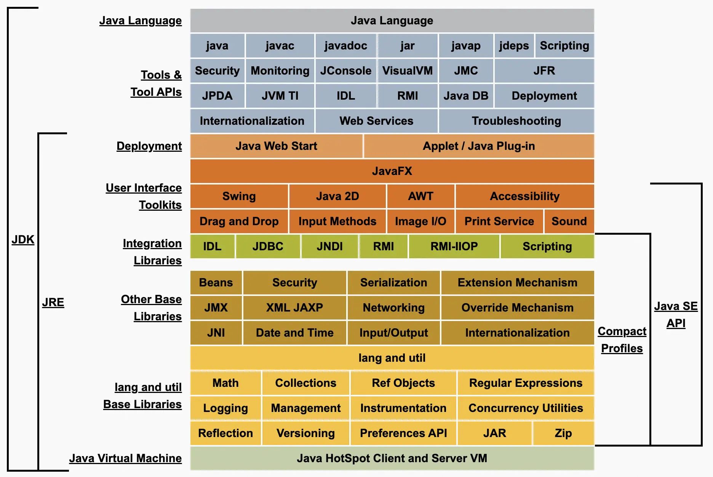

### Java 学习记录

#### Java 基础

1. **JDK、JRE、JVM 的区别**

JDK（Java Development Kit）、JRE（Java Runtime Environment）、JVM （Java Virtual Machine）是 Java 开发中的三个重要概念，JDK 包含了 JRE 和开发工具，JRE 包含了 JVM 和类库，JVM 是 Java 程序的运行环境。

在开发 Java 应用程序时，需要使用 JDK，而在运行 Java 应用程序时，只需要使用 JRE。

JDK 包含很多组件，如：

（1）Java 编译器：将 Java 代码编译成字节码的工具，可以将 Java 代码转换成可在 Java 虚拟机上运行的字节码文件。 

（2）Java 虚拟机：Java 虚拟机是 Java 程序的运行环境，可以在不同的操作系统上运行 Java 应用程序。

（3）Java 标准库：Java 标准库是 Java 开发的基础，包含了输入输出、集合框架、多线程、网络编程等方面的内容。

（4）Java 开发工具：JDK 包含了一些 Java 开发工具，如 javac、java、javadoc 等，可以用于编译、运行和生成文档等操作。
JavaFX：JavaFX 是 Java 的一个图形界面库，可以用于开发桌面应用程序。

JRE 包含了 Java 虚拟机和 Java 应用程序所需的类库等组件。与 JDK 不同的是，JRE 不包含 Java 编译器和其他开发工具，只包含 Java 运行环境所需的组件。

总结：
**JDK == JRE（JVM+核心类库）+开发工具**

开发工具：包含了编译java源码的编译器javac，还包含了很多java程序调试和分析的工具：jconsole，jvisualvm等工具软件等。
- javac：Java编译器。负责编译，将.java这个文本文件编译成.class字节码文件。
- java：Java程序启动器。负责启动Java虚拟机(JVM)以运行Java程序。其主要用来载入字节码文件中的主类、执行jar文件等。

JVM（Java Virtual Machine）是 Java 虚拟机的缩写，它负责 Java 程序的具体运行。Java 程序在运行时，会被编译成字节码文件，然后由 JVM 解释执行，因此 JVM 也被称为解释器。JVM 可以在不同的操作系统上运行 Java 应用程序，保证了 Java 的跨平台性。

JVM 包含以下主要组件：
- 类加载器：将字节码文件加载到内存中，并生成对应的类对象。
- 运行时数据区：包括方法区、堆、栈、程序计数器等，用于存储 Java 程序运行时所需的数据。
- 执行引擎：解释执行字节码文件，将字节码文件转换成机器码并执行。
- 本地方法接口：调用本地方法库，实现 Java 程序与本地系统的交互。

JVM 是 Java 程序运行的核心，保证了 Java 的跨平台性和安全性。
#### 