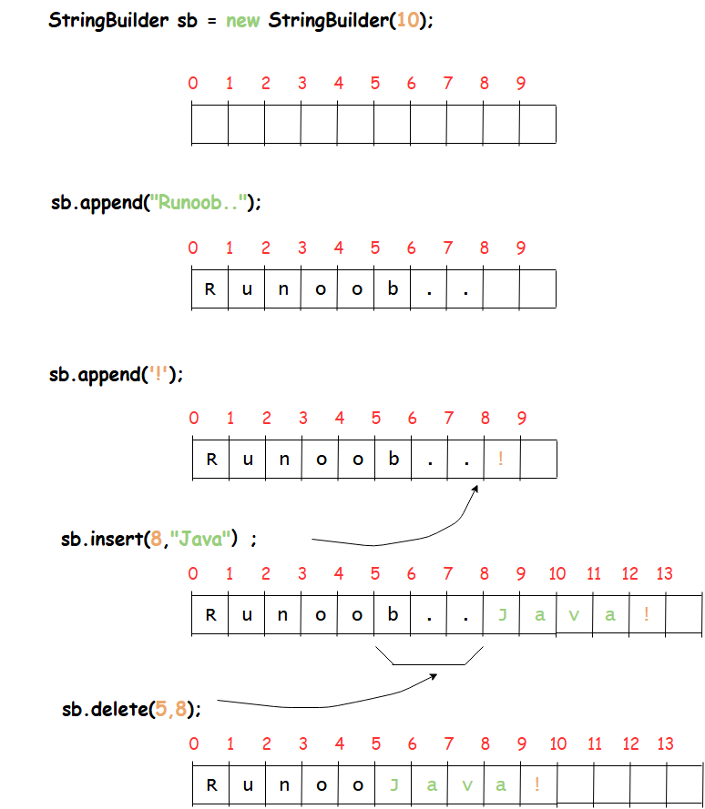

## Java 学习记录

### Java 基础

1. **JDK、JRE、JVM 的区别**

JDK（Java Development Kit）、JRE（Java Runtime Environment）、JVM （Java Virtual Machine）是 Java 开发中的三个重要概念，JDK 包含了 JRE 和开发工具，JRE 包含了 JVM 和类库，JVM 是 Java 程序的运行环境。

在开发 Java 应用程序时，需要使用 JDK，而在运行 Java 应用程序时，只需要使用 JRE。


JDK 包含很多组件，如：

（1）Java 编译器：将 Java 代码编译成字节码的工具，可以将 Java 代码转换成可在 Java 虚拟机上运行的字节码文件。 

（2）Java 虚拟机：Java 虚拟机是 Java 程序的运行环境，可以在不同的操作系统上运行 Java 应用程序。

（3）Java 标准库：Java 标准库是 Java 开发的基础，包含了输入输出、集合框架、多线程、网络编程等方面的内容。

（4）Java 开发工具：JDK 包含了一些 Java 开发工具，如 javac、java、javadoc 等，可以用于编译、运行和生成文档等操作。
JavaFX：JavaFX 是 Java 的一个图形界面库，可以用于开发桌面应用程序。

JRE 包含了 Java 虚拟机和 Java 应用程序所需的类库等组件。与 JDK 不同的是，JRE 不包含 Java 编译器和其他开发工具，只包含 Java 运行环境所需的组件。

总结：
**JDK == JRE（JVM+核心类库）+开发工具**

开发工具：包含了编译java源码的编译器javac，还包含了很多java程序调试和分析的工具：jconsole，jvisualvm等工具软件等。
- javac：Java编译器。负责编译，将.java这个文本文件编译成.class字节码文件。
- java：Java程序启动器。负责启动Java虚拟机(JVM)以运行Java程序。其主要用来载入字节码文件中的主类、执行jar文件等。


JVM（Java Virtual Machine）是 Java 虚拟机的缩写，它负责 Java 程序的具体运行。Java 程序在运行时，会被编译成字节码文件，然后由 JVM 解释执行，因此 JVM 也被称为解释器。JVM 可以在不同的操作系统上运行 Java 应用程序，保证了 Java 的跨平台性。

JVM 包含以下主要组件：
- 类加载器：将字节码文件加载到内存中，并生成对应的类对象。
- 运行时数据区：包括方法区、堆、栈、程序计数器等，用于存储 Java 程序运行时所需的数据。
- 执行引擎：解释执行字节码文件，将字节码文件转换成机器码并执行。
- 本地方法接口：调用本地方法库，实现 Java 程序与本地系统的交互。

JVM 是 Java 程序运行的核心，保证了 Java 的跨平台性和安全性。

2. 基本数据类型


默认值：


3. String

String 对象是不可变的，这意味着一旦创建，它们的值就无法更改。如果需要对字符串做很多修改，那么应该选择使用 StringBuffer & StringBuilder 类。

虽然 String 类中看起来有很多修改字符串内容的方法，但是其实都是生成新的字符串。 要改变字符串必须重新赋值。
因为源码`private final char`
```java
public final class String
    implements java.io.Serializable, Comparable<String>, CharSequence {
    /** The value is used for character storage. */
    private final char value[];
    //.....
}
```


```java
String str = "Runoob"; // String => 常量池中
String str2=new String("Runoob"); // new 的对象=》堆内存

System.out.println(str == str2); // false => 地址不同
System.out.println(str.equals(str2)); // true => 内容相同

String str3 = "Runoob";
System.out.println(str == str3); // true => 同一个地址：常量池
        
String str4 = new String("Runoob");
System.out.println(str2 == str4); // false => 每次new都是新的地址 堆
```
- 如果是基本数据类型，byte、short、int、long、float、double、char，如果是在方法中声明，则存储在栈中，其它情况都是在堆中（比方说类的成员变量就在堆中）
- 除了基本数据类型之外的对象，JVM会在堆中创建对象，对象的引用存于虚拟机栈中的局部变量表中
- 并不是所有的对象都在堆中存储，可以走栈上分配，在不在栈上分配取决于Hotspot的一个优化技术:“逃逸分析”


Java String 方法

|方法|描述|
|--|--|
length()|返回字符串的长度。
charAt(int index)|返回字符串中指定位置的字符。
substring(int beginIndex)|返回字符串中从指定位置开始到结尾的子串。
substring(int beginIndex, int endIndex)	|返回字符串中从 beginIndex 开始到 endIndex 的子串。
equals(Object obj)	|比较字符串是否相等。
equalsIgnoreCase(String anotherString)	|比较字符串是否相等，忽略大小写。
compareTo(String anotherString)|	比较字符串的大小关系。
compareToIgnoreCase(String str)	|比较字符串的大小关系，忽略大小写。
indexOf(int ch)|	返回指定字符在字符串中第一次出现的位置。
indexOf(int ch, int fromIndex)	|返回指定字符在字符串中从指定位置开始第一次出现的位置。
indexOf(String str)	|返回指定字符串在字符串中第一次出现的位置。
indexOf(String str, int fromIndex)	|返回指定字符串在字符串中从指定位置开始第一次出现的位置。
lastIndexOf(int ch)	|返回指定字符在字符串中最后一次出现的位置。
lastIndexOf(int ch, int fromIndex)	|返回指定字符在字符串中从指定位置开始最后一次出现的位置。
lastIndexOf(String str)	|返回指定字符串在字符串中最后一次出现的位置。
lastIndexOf(String str, int fromIndex)	|返回指定字符串在字符串中从指定位置开始最后出现的位置。
toCharArray()	|返回指定字符串的字符数组（ "aabb" => {'a','a','b','b'}）
trim()	|清空字符串收尾的空格（ "aabb" => "aabb"）

Java String 接口


- String 类实现了 `Comparable` 接口，因此可以使用 compareTo () 方法比较两个字符串的大小关系。如果字符串相等，则返回 0；如果当前字符串大于另一个字符串，则返回正整数；如果当前字符串小于另一个字符串，则返回负整数。

```java
String str1 = "abc";
String str2 = "abz";
System.out.println(str1.compareTo(str2));
System.out.println(str2.compareTo(str1));
// 输出：-23
// 输出：23
```
符串的比较是字符的自然排序比较，并不会比较总体的数值，比如字符串 199999 是小于字符串 2 的。
```java
System.out.println("19999".compareTo("2"));
// 输出：-1
```

`CharSequence` 用于表示一个字符序列的抽象。CharSequence 接口位于 java.lang 包中，是 Java 中的一个接口，CharSequence 接口定义了以下方法：
- charAt (int index)：返回指定位置的字符。
- length ()：返回字符序列的长度。
- subSequence (int start, int end)：返回从 start 到 end 的子序列。
- chars () : 返回字符串的 IntStream 流。
- codePoints (): 和 chars 类似，返回字符串的 IntStream 流。

由于 String 对象是不可变的，因此每次对字符串进行修改都会创建一个新的 String 对象。如果需要频繁修改字符串，可以使用 StringBuilder 或 StringBuffer 类。StringBuilder 和 StringBuffer 类提供了许多方法，用于修改字符串，例如 append () 方法用于在字符串末尾添加字符或字符串，insert () 方法用于在字符串中插入字符或字符串，等等。StringBuilder 和 StringBuffer 类的区别在于，StringBuilder 类是线程不安全的，而 StringBuffer 类是线程安全的。


4. Java StringBuilder

Java 中的 StringBuilder 类是一种可变字符串类型，它提供了一种高效的字符串操作方式。与 String 类不可变不同，StringBuilder 可以修改字符串的内容而不会创建新的对象。在本文中，我们将从四个方面介绍 StringBuilder 类，包括其实现原理、构造方法、重要方法以及需要注意的事项。
StringBuffer 和 StringBuilder 在使用方式上几乎是完全相同的，所以不再单独介绍 StringBuffe。它们的主要的区别如下：

|| StringBuffer |	StringBuilder|
|--|--------------|--|
线程安全| 	是	          |否
效率| 	低（因为线程安全加锁） |	高
适用场景	| 多线程环境	       |单线程环境
初始容量	| 16           |	16
增长方式	| 翻倍 + 2	      |翻倍 + 2
API	|同步方法|	非同步方法
JDK 版本	|JDK 1.0|	JDK 1.5

StringBuilder 的实现原理是**基于可变字符数组的动态扩容机制**。
StringBuilder 类在创建对象时会默认创建一个字符长度为 16 个字符的数组,可自定义容量。
```java
    @IntrinsicCandidate
    public StringBuilder() {
        super(16);
    }
    @IntrinsicCandidate
    public StringBuilder(int capacity) {
        super(capacity);
    }
```

```java
StringBuilder sb = new StringBuilder(10);
sb.append("Runoob..");
System.out.println(sb);
sb.append("!");
System.out.println(sb);
sb.insert(8, "Java"); // Runoob..Java!
System.out.println(sb);
sb.delete(5,8);// RunooJava! =》删除[5,8)
System.out.println(sb);
```




关于JAVA17中的StringBuilder：
```java
    AbstractStringBuilder(String str) {
        int length = str.length();
        int capacity = (length < Integer.MAX_VALUE - 16)
                ? length + 16 : Integer.MAX_VALUE;
        final byte initCoder = str.coder();
        coder = initCoder;
        value = (initCoder == LATIN1)
                ? new byte[capacity] : StringUTF16.newBytesFor(capacity);
        append(str);
    }
```
不直接传入字符串创建默认16，传入默认字符串长度+16
```java
StringBuilder st = new StringBuilder();
st.append("Runoob");
System.out.println(st.capacity()); // 16
st.append("RunoobJavaJava");
System.out.println(st.capacity()); //34
st.delete(3, 7);
System.out.println(st.capacity()); //34
```
字符数组扩容为原来的两倍加二,且删除后容量不减小。

```java
private int newCapacity(int minCapacity) {
    int oldLength = value.length;
    int newLength = minCapacity << coder;
    int growth = newLength - oldLength;
    int length = ArraysSupport.newLength(oldLength, growth, oldLength + (2 << coder));
    if (length == Integer.MAX_VALUE) {
        throw new OutOfMemoryError("Required length exceeds implementation limit");
    }
    return length >> coder;
}

public static int newLength(int oldLength, int minGrowth, int prefGrowth) {
    // preconditions not checked because of inlining
    // assert oldLength >= 0
    // assert minGrowth > 0

    int prefLength = oldLength + Math.max(minGrowth, prefGrowth); // might overflow
    if (0 < prefLength && prefLength <= SOFT_MAX_ARRAY_LENGTH) {
        return prefLength;
    } else {
        // put code cold in a separate method
        return hugeLength(oldLength, minGrowth);
    }
}

```
`prefLength`优选长度是旧长度加上最小增长量和优选增长量中的较大值（确保足够的扩展空间）。

StringBuilder 类提供了多个实用的方法，包括 append、insert、delete、replace 等。

|方法名|	功能解释|
|--|--|
StringBuilder()	|创建一个空的 StringBuilder 对象
StringBuilder(int capacity)|	创建一个具有指定初始容量的 StringBuilder 对象
append(String str)	|将指定字符串添加到此字符序列的末尾
insert(int offset, String str)|	将指定字符串插入此字符序列中的指定位置
replace(int start, int end, String str)	|用指定字符串替换此序列的子字符串
delete(int start, int end)	|移除此序列的子字符串中的字符
reverse()	|将此字符序列用其反转形式取代

5. Java Scanner

Scanner 类的使用非常简单直观，首先需要创建一个 Scanner 对象，然后使用该对象的 next ()、nextInt ()、nextDouble () 等方法来读取用户输入的数据.
```java
public class ScannerDemo {
    public static void main(String[] args) {
        Scanner scanner = new Scanner(System.in);
        System.out.println("请输入一个字符串：");
        String inputString = scanner.next();
        System.out.println("你输入的字符串是：" + inputString);
    }
}
```

同时有解决换行符导致输入不完整的问题：
请输入一个字符串：
hello world
你输入的字符串是：hello
```java
public class ScannerDemo {
    public static void main(String[] args) {
        Scanner scanner = new Scanner(System.in);
        System.out.println("请输入一个字符串：");
        String inputString = scanner.next();
        System.out.println("你输入的字符串是：" + inputString);
    }
}
```

6. JAVA 异常

（1）常见异常

异常	|描述
--|--
NullPointerException	|当试图在需要对象的地方使用 null 时，抛出该异常。
ArrayIndexOutOfBoundsException	|当试图访问数组的索引超出范围时，抛出该异常。
ClassNotFoundException	|程序试图加载类时，找不到相应的类，抛出该异常。
DivideByZeroException	|当除数为零时，抛出该异常。
FileNotFoundException	|当程序试图打开一个不存在的文时，抛出该异常。
ClassCastException	|当试图将对象强制转换为不能转换的类型时，抛出该异常。
IOException	|当发生某种 I/O 异常时，抛出该异常。
NoSuchMethodException	|当试图访问一个不存在的方法时，抛出该异常。
NumberFormatException	|当应用程序试图将字符串转换为数字，但该字符串不能转换为数字时，抛出该异常。
ClassNotFoundException	|应用程序试图加载类时，找不到相应的类，抛出该异常。
SQLException	|当访问数据库时出现问题时，抛出该异常。
InterruptedException	|当一个线程处于等待状态，另一个线程中断该线程时，抛出该异常。
IllegalArgumentException	|当向方法传递一个不合法或不正确的参数时，抛出该异常。
ConcurrentModificationException	|遍历集合时修改集合中的对象时报错，往往是使用的非线程安全集合。

（2）Exception 是一个类，用于表示程序运行时发生的错误或异常情况。当程序执行过程中出现错误或异常时，程序会抛出一个 Exception 对象，开发人员可以通过捕捉这个对象并对其进行处理来避免程序崩溃或出现不可预料的结果。

Java Exception 的处理方式有两种，分别是 `try-catch` 和 `throw`。`try-catch` 语句用于捕捉并处理 `Exception` 对象.
throw 语句用于手动抛出异常对象，期望由上次调用者进行处理。

（3）Java Exception 分为两类，分别是受检异常 checked Exception 和非受检异常 unchecked Exception。受检异常是指必须在程序中进行捕捉和处理的异常，如果不进行处理，程序将无法通过编译。而非受检异常则是指可以不在程序中进行捕捉和处理的异常，但是如果发生了这类异常而没有捕捉处理，程序会立即崩溃停止运行。

通过一个 Java 异常继承关系图区分受检异常和非受检异常：

从图中我们发现 Java 异常的一个特点是，所有异常都是 Throwable 的子类。Throwable 的子类 Error 异常通常是不需要我们去处理的，所以重点就是 Exception 异常类了，它是 Java 程序常见的异常的基类。

所有的非受检异常都是 RuntimeException 的子类或者 Error 子类，所以上面的几个例子中空指针异常和数组越界异常，都是非受检异常，如果不主动捕获异常，程序也是可以编译通过的，只是在运行时遇到异常会表现出来。

其他的 Exception 的子类且非 RuntimeException 子类的异常，都是受检异常，都需要进行手动捕捉处理，否则程序编译不通过。

(4) 程序是否有异常都会执行`finally`程序块代码。
```java
int i = 0;
try {
    System.out.println(i);
} catch (Exception e) {
    System.out.println(e.getMessage());
}finally {
    System.out.println(i+1);
}

try {
    System.out.println(9/i);
}catch (Exception e) {
    System.out.println(e.getMessage());
}finally {
    System.out.println(i+6);
}
```
（5）读取文件关闭文件可以采用 try-catch-finally 方式，但JAVA7后提供更简洁的方式：`try-with-resource`:被 try 括号包围的资源会自动调用 close 方法，不管是否发生异常.
```java
File file = new File("pom.xml");
try (FileReader fileReader = new FileReader(file); BufferedReader bufferedReader = new BufferedReader(
        fileReader);) {
    String line;
    while ((line = bufferedReader.readLine()) != null) {
        System.out.println(line);
    }
} catch (FileNotFoundException e) {
    System.out.println("文件不存在");
} catch (IOException e) {
    System.out.println("读取文件失败");
}
```
（6）自定义异常


7. Java 枚举
   
Java 枚举是一种特殊的数据类型，它允许我们定义一组常量，并且可以在程序中使用这些常量。枚举常量是一组有意义的、不可变的值，通常用于表示某些特定的状态、类型或选项。在 Java 中，枚举是通过 `enum` 关键字来定义的。可以说，Java 枚举提供了一种更加优雅、类型安全和易于维护的方式来管理常量。

定义一个枚举类型需要使用 enum 关键字，语法如下：
```java
enum EnumName {
  CONSTANT1,
  CONSTANT2,
  ...
}
```

8. Java Array

Java 中的 Array 有以下特点：

(1)**长度固定**：Array 的长度在创建时就已经确定，并且不能被修改，但是可以指向其他数组。
(2)**同类型元素**：Array 中的所有元素必须是同一种类型（对象类型存储的是引用）。
(3)**内存连续**：Array 存储在连续的内存位置。
(4)**下标从 0 开始**：Array 中的元素是通过下标来访问的，下标从 0 开始，最大下标为长度减 1。
(5)给定数组下标访问下标对应的元素时，的时间复杂度为 1。
(6)Array 是 Java 中的对象，因此可以使用对象属性 length 获取到 Array 的长度。
(7)Java 中 Array 都实现了 Cloneable 和 java.io.Serializable 接口。
(8)**数组定义语法**：`type [] name`; 或者 `type name []`。

```java
// 创建方式1：new
int[] arr = new int[2];
String[] strArr = new String[5];

// 创建方式2：
String[] arr = { "Hello", "world", "!" };
```
Java 中的数组实现了 Cloneable 方法，所以可以直接复制：(clone 对于多维数组的拷贝，只会进行浅拷贝。)
```java
int[] arr = new int[10];
for (int i = 0; i < arr.length; i++) {
    arr[i] = i;
}

int[] arr2 = arr.clone();
arr2[0] = 100;
System.out.println(arr[0]); // 0

// 浅拷贝只复制指向某个对象的指针，而不复制对象本身，新旧对象还是共享同一块内存（分支）
String[][] str = new String[2][2];
str[0][0] = "Hello";
str[0][1] = "World";
String[][] str2 = str.clone();
str2[0][0] = "Java";
System.out.println(str[0][0]); // Java

```

Java 中的 Arrays 类提供了一系列用于操作数组的静态方法。以下是 Arrays 常用的操作方法：

|方法名	|描述|
--|--
sort()	|对数组进行排序
parallelSort()	|并行排序数组
binarySearch()	|对已排序的数组进行二分查找
equals()	|比较两个数组是否相等
fill()	|将数组的所有元素都赋为指定的值
toString()	|将数组转换成字符串输出
copyOf()	|复制数组
asList()	|将数组转换成 List


重点`sort`方法的使用：
```java
Integer[] arr5 = {2, 1, 9, 4, 6, 7, 3};
Arrays.sort(arr5); // 升序
System.out.println(Arrays.toString(arr5));
Arrays.sort(arr5, new Comparator<Integer>() { // 降序
    @Override
    public int compare(Integer o1, Integer o2) {
        return Integer.compare(o2,o1);
    }
});
System.out.println(Arrays.toString(arr5)); 
```

```java
public class Entity implements Comparable<Entity> {
    Integer a;
    Integer b;

    public Entity(Integer a, Integer b) {
        this.a = a;
        this.b = b;
    }

    @Override
    public int compareTo(Entity o) {
        // 优先以a升序排列，其次以b降序排序
        if (!Objects.equals(this.a, o.a)){
            return this.a - o.a;
        }
        return o.b - this.b;
    }
}

Entity[] entity = new Entity[5];
entity[0] = new Entity(2, 5);
entity[1] = new Entity(4, 3);
entity[2] = new Entity(1, 9);
entity[3] = new Entity(2, 7);
entity[4] = new Entity(6, 10);
Arrays.sort(entity);
for (int i = 0; i < entity.length; i++) {
    System.out.println(entity[i].a+"==="+entity[i].b);
}
        //1===9
        //2===7
        //2===5
        //4===3
        //6===10
```

数组、List和ArrayList的区别：

- 数组在内存中是连续存储的，所以它的索引速度是非常的快，而且赋值与修改元素也很简单。
- 但是数组也存在一些不足的地方。比如在数组的两个数据间插入数据也是很麻烦的，还有我们在声明数组的时候，必须同时指明数组的长度，数组的长度过长，会造成内存浪费，数组和长度过短，会造成数据溢出的错误。这样如果在声明数组时我们并不清楚数组的长度，就变的很麻烦了。
- ArrayList**它的大小是按照其中存储的数据来动态扩充与收缩的**。 所以，我们在声明ArrayList对象时并不需要指定它的长度。ArrayList继承了List接口，所以它可以很方便的进行数据的添加，插入和移除.


#### Java面向对象 